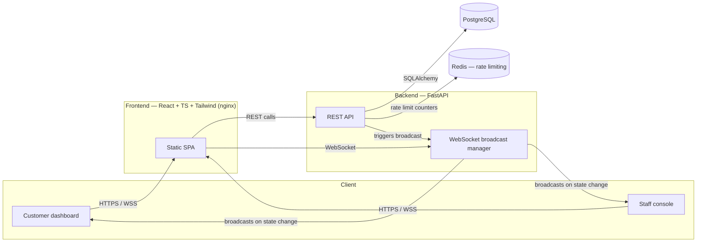

# QueueFlow

**Real-time queue & appointment management platform.**
Skip the queue. Know your turn.

QueueFlow replaces the physical waiting line at clinics, banks, campus offices, salons and
service counters with a live digital ticket: join a queue, watch your position update in
real time with no page refresh, and get an alert when your turn is close.

---

## Table of contents

- [Problem & solution](#problem--solution)
- [Features](#features)
- [Architecture](#architecture)
- [Tech stack](#tech-stack)
- [Database schema](#database-schema)
- [API documentation](#api-documentation)
- [Local setup](#local-setup)
- [Environment variables](#environment-variables)
- [Docker setup](#docker-setup)
- [Testing](#testing)
- [CI/CD](#cicd)
- [Deployment](#deployment)
- [Limitations & what's not verified](#limitations--whats-not-verified)
- [Future improvements](#future-improvements)
- [Resume bullets](#resume-bullets)
- [Interview explanation](#interview-explanation)

---

## Problem & solution

People waste time physically standing in line at service counters because there's no way to
know how long the wait actually is. QueueFlow gives customers a digital ticket with a live
position and estimated wait time, and gives staff an operations console to run the queue —
call the next customer, skip a no-show, pause for a break, and see real analytics on how the
desk performed.

## Features

**Customer**
- Register / log in with JWT-authenticated accounts
- Browse active services and their open queues
- Join a queue and receive a sequential token (e.g. `A047`)
- Live position, current-serving token, and estimated wait — pushed over WebSocket, no refresh
- "Your turn is approaching" alert once a configurable number of people remain ahead
- Cancel a waiting ticket; view recent ticket history
- Schedule, view, and cancel appointments independent of a live queue

**Staff / Admin**
- Create and deactivate services; open, pause, resume, and close queues
- Call next, skip, and serve tickets, with guardrails against invalid transitions
  (can't call next on an empty or paused queue, can't serve a ticket twice, etc.)
- Live queue state view shared with connected customer dashboards
- Analytics: customers served today, average wait, average service time, active queues,
  skipped tickets, busiest hour — computed from real ticket history, not fabricated

## Architecture



**Why this shape:** a single FastAPI instance owns both the REST API and an in-process
WebSocket connection manager keyed by queue ID. Every mutating action (join, call-next, skip,
serve, pause/resume/close) runs inside a Postgres row lock on the queue (`SELECT ... FOR
UPDATE`) so two staff clicks at the same instant can't double-advance the counter, then
broadcasts the resulting queue state to every socket subscribed to that queue. This keeps the
system easy to reason about and explain end-to-end. If QueueFlow needed to scale beyond one
backend replica, the connection manager's internals would move to Redis pub/sub — the call
sites (`await manager.broadcast(...)`) wouldn't need to change.

Redis today is used for lightweight rate limiting (fixed-window counters keyed by
IP + minute) rather than session or queue state, because Postgres is already the source of
truth for queue state and a second copy would just be another place for it to drift.

## Tech stack

| Layer | Choice | Why |
|---|---|---|
| Frontend | React 19, TypeScript, Tailwind CSS v4, React Router | Typed components, utility-first styling, client-side routing for two distinct app shells (customer/staff) |
| Backend | FastAPI, Python 3.12 | Async-friendly, built-in OpenAPI docs, Pydantic validation |
| Database | PostgreSQL 16 | Relational integrity for queue/ticket state machine, row locking for concurrency safety |
| Cache | Redis 7 | Rate limiting |
| Real-time | Native WebSockets (FastAPI) | No extra broker needed at this scale |
| Migrations | Alembic | Reproducible schema, autogenerated from SQLAlchemy models |
| Auth | JWT (`python-jose`) + `bcrypt` | Stateless auth, industry-standard password hashing |
| Containerization | Docker, Docker Compose | Reproducible local + deploy environment |
| CI | GitHub Actions | Lint, type-check, test, build on every push |

## Database schema

Seven tables: `users`, `services`, `queues`, `tickets`, `appointments`, `service_records`,
`notifications`. Full detail in [`docs/schema.md`](docs/schema.md).

Ticket status machine: `WAITING → CALLED → SERVING → SERVED`, with `SKIPPED` and `CANCELLED`
as terminal branches from `WAITING`/`CALLED`. Queue status: `OPEN ⇄ PAUSED`, `→ CLOSED`
(terminal). Every transition is enforced in `app/services/queue_service.py`, not just at the
API layer, so there's one place that owns the rules.

## API documentation

Interactive Swagger UI is served at `/docs` (and ReDoc at `/redoc`) once the backend is
running. Key endpoints:

```
POST   /api/auth/register
POST   /api/auth/login
GET    /api/auth/me

GET    /api/services
POST   /api/services                       (staff/admin)
PATCH  /api/services/{id}                  (staff/admin)

GET    /api/queues
POST   /api/queues                         (staff/admin)
POST   /api/queues/{id}/join
WS     /api/queues/{id}/ws

GET    /api/tickets/mine
GET    /api/tickets/{id}
POST   /api/tickets/{id}/cancel

GET    /api/staff/queues/{id}/state        (staff/admin)
GET    /api/staff/queues/{id}/waiting      (staff/admin)
POST   /api/staff/queues/{id}/next         (staff/admin)
POST   /api/staff/queues/{id}/pause        (staff/admin)
POST   /api/staff/queues/{id}/resume       (staff/admin)
POST   /api/staff/queues/{id}/close        (staff/admin)
POST   /api/staff/tickets/{id}/serve       (staff/admin)
POST   /api/staff/tickets/{id}/skip        (staff/admin)

GET    /api/appointments
POST   /api/appointments
POST   /api/appointments/{id}/cancel

GET    /api/analytics                      (staff/admin)
GET    /api/health
```

## Local setup

**Requirements:** Python 3.12+, Node 22+, PostgreSQL 16, Redis 7 (or use Docker Compose —
see below — for the databases only).

```bash
# 1. Backend
cd backend
python3 -m venv venv
source venv/bin/activate            # Windows: venv\Scripts\activate
pip install -r requirements.txt
cp .env.example .env                # then edit DATABASE_URL / REDIS_URL / JWT_SECRET_KEY
alembic upgrade head
uvicorn app.main:app --reload       # http://localhost:8000, docs at /docs

# 2. Frontend (separate terminal)
cd frontend
npm install
cp .env.example .env                # VITE_API_URL should point at the backend above
npm run dev                         # http://localhost:5173
```

## Environment variables

**Backend** (`backend/.env`, see `backend/.env.example`):

| Variable | Purpose |
|---|---|
| `DATABASE_URL` | Postgres connection string |
| `REDIS_URL` | Redis connection string |
| `JWT_SECRET_KEY` | Signing key for access tokens — **generate a real one** (`openssl rand -hex 32`) |
| `JWT_ALGORITHM` | Defaults to `HS256` |
| `ACCESS_TOKEN_EXPIRE_MINUTES` | Token lifetime |
| `CORS_ORIGINS` | Comma-separated allowed origins |
| `RATE_LIMIT_PER_MINUTE` | Per-IP request budget |
| `SMART_ALERT_THRESHOLD` | People-ahead count that triggers "your turn is approaching" |
| `DEFAULT_AVG_SERVICE_MINUTES` | Fallback wait estimate before a queue has history |

**Frontend** (`frontend/.env`, see `frontend/.env.example`):

| Variable | Purpose |
|---|---|
| `VITE_API_URL` | Base URL of the backend API (baked into the build at build time) |

**Root** (`.env`, see `.env.example`) — used by `docker-compose.yml`:
`JWT_SECRET_KEY`, `CORS_ORIGINS`, `VITE_API_URL`.

Never commit a real `.env` file — only `.env.example` templates are tracked.

## Docker setup

```bash
cp .env.example .env      # set a real JWT_SECRET_KEY
docker compose up --build
```

This builds and runs four services: `postgres`, `redis`, `backend` (runs Alembic migrations
on start, then serves the API on `:8000`), and `frontend` (nginx serving the built SPA on
`:8080`). See [Limitations](#limitations--whats-not-verified) — the Dockerfiles and compose
file are written correctly but could not be executed in the environment this project was
built in (no Docker daemon available there), so run `docker compose up --build` yourself as
the first real test of this layer.

## Testing

```bash
cd backend
source venv/bin/activate
pytest app/tests/ -v
```

**43 tests, all passing**, run against a real PostgreSQL 16 + Redis 7 instance (not SQLite,
not mocked) — this matters because one real bug (a `GROUP BY` query that SQLite would have
silently accepted but Postgres correctly rejected) only surfaced by testing against the same
database engine used in production. Coverage: registration/login validation, password
hashing, JWT validation, role-based authorization (customer/staff/admin boundaries), full
queue lifecycle (join → call → serve, skip, cancel), invalid-transition rejection (empty
queue, double-call, re-serving a served ticket, resuming a closed queue), wait-time
estimation, analytics correctness on both populated and empty data, and the health endpoint.

Frontend: `cd frontend && npx tsc -b && npm run build` — verified as part of this build
(zero type errors, clean production build). No browser-level end-to-end tests are included;
see Limitations.

## CI/CD

`.github/workflows/ci.yml` runs on every push/PR to `main`:

```
checkout → install deps → lint → migrate → test → build (frontend) → build Docker images → deploy (main only)
```

Backend and frontend jobs run in parallel, each against real service containers (Postgres +
Redis for the backend job). The workflow fails if lint, type-check, tests, or either build
fails. The `deploy` job is a placeholder that only runs after both build jobs succeed — see
[Deployment](#deployment) for why it isn't wired to a real target yet.

## Deployment

**No live URL is provided with this project.** The environment this project was built in has
no access to any deployment platform's API (Render, Railway, Fly.io, AWS, etc.) — only
package registries and GitHub. Rather than claim a deployment that didn't happen, here is
exactly what's needed to deploy it for real:

1. Pick a platform with persistent Postgres, WebSocket support, and free/low-cost tiers —
   **Render** or **Railway** are the most practical fits for this stack (both support
   long-lived WebSocket connections, unlike some serverless platforms).
2. Provision a managed Postgres and Redis instance (or use the platform's add-ons).
3. Deploy `backend/` as a Docker-based web service. Set the environment variables listed
   above (`DATABASE_URL`, `REDIS_URL`, `JWT_SECRET_KEY`, `CORS_ORIGINS` pointing at the
   frontend's deployed URL). The container's `CMD` already runs `alembic upgrade head` on
   boot, so no separate migration step is needed.
4. Deploy `frontend/` as a static site or Docker-based web service, with build arg
   `VITE_API_URL` set to the backend's deployed URL.
5. Confirm `GET /api/health` returns `{"status": "healthy", ...}`, then test register → join
   queue → call next → live update end-to-end.

Full step-by-step commands per platform are in [`docs/DEPLOYMENT.md`](docs/DEPLOYMENT.md).

## Limitations & what's not verified

Being direct about this rather than glossing over it:

- **No live deployment URL** — see above.
- **Docker Compose is untested at runtime** — no Docker daemon was available in the build
  environment, so `docker compose up --build` has not actually been run. The Dockerfiles
  follow standard multi-stage patterns and the compose file's service wiring (healthchecks,
  `depends_on: condition: service_healthy`, env var passing) is correct by inspection, but
  "correct by inspection" is not the same as "verified by running it."
- **No browser-level end-to-end test** — the frontend was verified via TypeScript
  type-checking and a successful production build, not by loading it in a real browser
  against the running backend. Wire up Playwright or Cypress against a running
  `docker compose` stack for that coverage.
- **Self-registration includes a STAFF option** — for demo convenience, anyone can register
  as staff. In a real deployment, staff accounts should be provisioned by an admin (e.g. an
  invite-only registration flow or an admin-only user-creation endpoint), not self-service.
- **Rate limiting is fixed-window, not sliding-window** — simple and Redis-cheap, but allows
  a burst at window boundaries. Fine for this project's scale; a sliding-window or
  token-bucket approach would be the upgrade for a higher-traffic deployment.
- **Notifications are in-app only** — no SMS/email/push integration exists or is claimed.

## Future improvements

- Wire the CI `deploy` job to a real platform and publish a live demo URL
- Playwright end-to-end tests covering the full customer + staff flow in a real browser
- Move the WebSocket connection manager to Redis pub/sub for multi-replica deployments
- Sliding-window rate limiting
- Admin-only staff provisioning instead of open self-registration
- Push/SMS notifications for the "turn approaching" alert (currently in-app only)

## Resume bullets

- Built a real-time queue management platform using React, FastAPI, PostgreSQL, Redis and
  WebSockets, enabling live ticket tracking and automated queue updates with no page refresh.
- Implemented a transactional queue state machine with row-level locking to prevent race
  conditions on concurrent staff actions, backed by role-based JWT authentication and
  Postgres-backed analytics.
- Containerized the application with Docker and automated linting, type-checking, testing,
  and image builds through a GitHub Actions CI pipeline running against real Postgres and
  Redis service containers.

## Interview explanation

*"QueueFlow is a queue management system with two apps sharing one FastAPI backend: a
customer view that shows your live ticket position, and a staff console to run the queue.
The interesting engineering problem is concurrency — two staff members could click 'call
next' at the same instant, so every state-changing operation takes a row lock on the queue
before it reads or writes ticket state, which serializes those operations at the database
level rather than trying to coordinate it in application code. State changes broadcast over
WebSocket to an in-process connection manager keyed by queue ID, so customer dashboards
update live without polling. I tested it against real Postgres and Redis rather than SQLite
or mocks specifically because I hit a real bug — a GROUP BY query — that only Postgres caught;
SQLite would have silently let it through."*

---

## Local run commands (quick reference)

```bash
# Backend
cd backend && source venv/bin/activate && uvicorn app.main:app --reload

# Frontend
cd frontend && npm run dev

# Tests
cd backend && pytest app/tests/ -v

# Docker (all services)
docker compose up --build
```
